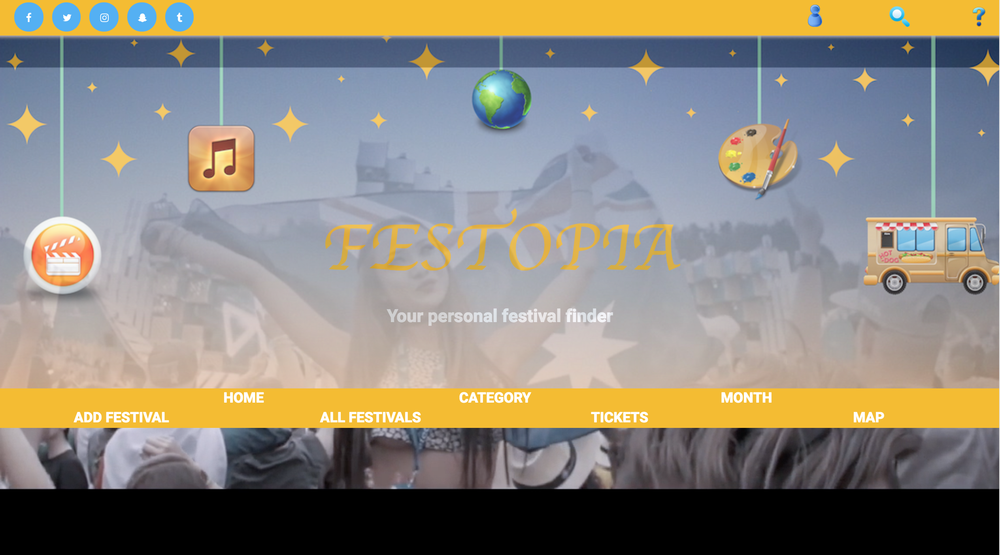
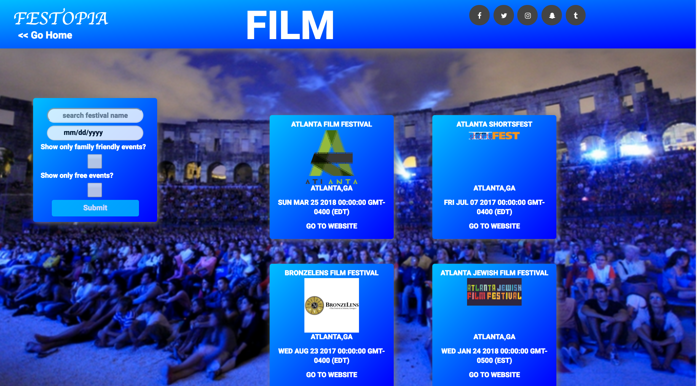
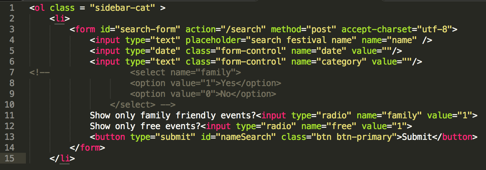
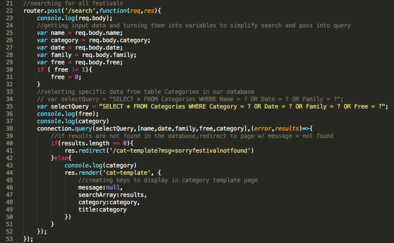

# Festopia

## About
Festopia is a web application that connects users to festivals throughout metro-Atlanta. Users have the ability to search festivals via multiple filters to find the perfect festival experience to meet their needs. 

## Team Members
- [Porscha Johnson]
- [Carla Severe]
- [Michael Gaynor]
- [Daniel Oliva]

## Languages and Technologies

##### Front End

HTML |  CSS | JavaScript | jQuery 

##### Back End

 Node.js | Express | SQL | Amazon Web Services

#### Dependencies and Plugins
 bcrypt-nodejs|body-parser|cookie-parser|debug|ejs|express-session |morgan | mysql| request|
 serve-favicon

## Team Strategy

A month before the project started, we got together in meetings to brainstorm our project's scope and functionality by creating mock-ups, discussing required technologies, and finalizing our team's strategy. We incorporated the agile project management methodology throughout our planning process by developing an agressive sprint schedule with focused objectives and stretch goals. No APIs were available for our project, so we individually researched festivals and created a database based on five categories (food, culture, music, art, film). We mob programmed the backend and individually programmed the frontend portion of the pages. 

## Site Walkthrough

### Home Page

Our home page features links to all listed festivals. It also allows the user to quickly narrow their search by picking a category. The home page has several other features, such as social media buttons, that can be used to share the page in addition to a google map of Metro Atlanta. 

	

## Category Page
Each festival category has its own page. Users can refine their search via festival name, date, selecting only family-friendly events, or selecting only free events. 

	

	

 
## All Festivals Pages

We also provided a page containing all of the festivals in our database.

	

## Challenges

### Challenge 1:
Our first challenge was mastering Github and Source Tree as a group. Despite each having Github profiles, we had zero experience working with other people on one repository. Knowing this, we dedicated much of the first day to learning the process through reading and testing. By the end of the project, we were comfortable using these tools and created a competition to get the most commits. 

### Challenge 2:
Our second challenge was transmitting the data from the browser to a database. First, it was difficult to narrow our search to a particular request. 

	

To solve this issue, we added a category input tag so the information would be kept on corresponding page to be returned.
	

	

[Porscha Johnson]:<https://github.com/Porscha07>
[Carla Severe]: <https://github.com/csevere>
[Michael Gaynor]: <https://github.com/MichaelGaynor>
[Daniel Oliva]: <https://github.com/kalgcny09>
[here]:<>
