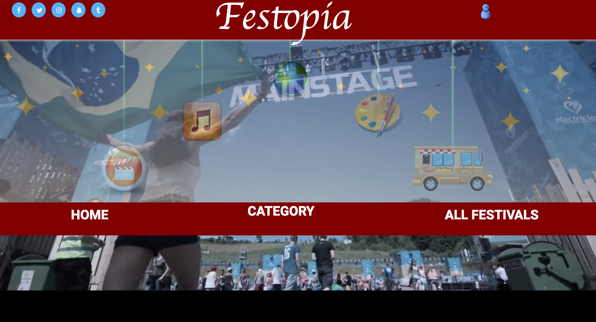

# Festopia

## About
<<<<<<< HEAD
Festopia connects users to festivals in the metro-Atlanta area. Users can search for festivals using a variety of filters to narrow their festival list to the perfect festival that works for them. Check it out [here].
=======
Festopia is a web application that connects users to festivals throughout metro-Atlanta. Users have the ability to search festivals via multiple filters to find the perfect festival experience to meet their needs. 
>>>>>>> 6835847530b3e33f078ca44efea5bfe508514abd

## Team Members
- [Porscha Johnson]
- [Carla Severe]
- [Michael Gaynor]
- [Daniel Oliva]

<<<<<<< HEAD
## Tools Used for This Project
=======
## Languages and Technologies
>>>>>>> 6835847530b3e33f078ca44efea5bfe508514abd

##### Front End

HTML |  CSS | JavaScript | jQuery 

##### Back End

<<<<<<< HEAD
 Node.js | Express |SQL | Amazon Web Services

## Team Strategy

Porscha came up with the idea and over the weeks the other team members joined. 

We incorporated agile and Microsoft OneNote tools to move our project along. From start to finish, we made notes each sesssion about the progress that was done and created goals for the next session.

Our early team meetings were focused on coming up with the design and layout of the website. After they were drawn, we agreed to mob program certain pages to keep pages, themes, languages, and colors consistent. Unfortunately, for data purposes, we could not find an API that lists festivals in Atlanta, if any exists. Instead, we found festivals through google searches and put their information into a database using Sequel Pro. Along, the way we individually contributed to pages to accomplish new tasks that arised and to fill in gaps in our plans.

Once the product was completed, we uploaded it to our Amazon Web Servers for your viewing pleasure.

Site Walkthrough

Home Page

Our home page brings the user directly to features the user would want to access right away such as link to all the festivals listed, which can then be narrowed down on the next page. In the event the user knows what the user wants, it also allows them to quickly narrow their search by picking a category. The home page has several other features like social media buttons that can be used to share this page. 

[ INSERT PICTURE ]

Category Page
Each category has its own page. Users can refine their search by searching for festival names, entering a range date, selecting family-friendly events, or selecting free events. 

[INSERT PICTURE ]

All Festivals Pages

We also provided a page containing all the festivals for the user who simply does not know what kind of festival a user wishes to attend. 

=======
 Node.js | Express | SQL | Amazon Web Services

#### Dependencies and Plugins
 bcrypt-nodejs|body-parser|cookie-parser|debug|ejs|express-session |morgan | mysql| request|
 serve-favicon

## Team Strategy

A month before the project started, we got together in meetings to brainstorm our project's scope and functionality by creating mock-ups, discussing required technologies, and finalizing our team's strategy. We incorporated the agile project management methodology throughout our planning process by developing an agressive sprint schedule with focused objectives and stretch goals. No APIs were available for our project, so we individually researched festivals and created a database based on five categories (food, culture, music, art, film). We mob programmed the backend and individually programmed the frontend portion of the pages. 

## Site Walkthrough

### Home Page

Our home page features links to all listed festivals. It also allows the user to quickly narrow their search by picking a category. The home page has several other features, such as social media buttons, that can be used to share the page in addition to a google map of Metro Atlanta. 

	

## Category Page
Each festival category has its own page. Users can refine their search via festival name, date, selecting only family-friendly events, or selecting only free events. 

	

	

 
## All Festivals Pages

We also provided a page containing all of the festivals in our database.

	

## Challenges

### Challenge 1:
Our first challenge was mastering Github and Source Tree as a group. Despite each having Github profiles, we had zero experience working with other people on one repository. Knowing this, we dedicated much of the first day to learning the process through reading and testing. By the end of the project, we were comfortable using these tools and created a competition to get the most commits. 

### Challenge 2:
Our second challenge was transmitting the data from the browser to a database. First, it was difficult to narrow our search to a particular request. 

	

To solve this issue, we added a category input tag so the information would be kept on corresponding page to be returned.
	

	

>>>>>>> 6835847530b3e33f078ca44efea5bfe508514abd

[Porscha Johnson]:<https://github.com/Porscha07>
[Carla Severe]: <https://github.com/csevere>
[Michael Gaynor]: <https://github.com/MichaelGaynor>
[Daniel Oliva]: <https://github.com/kalgcny09>
[here]:<>
<<<<<<< HEAD
# new-festopia
=======
>>>>>>> 6835847530b3e33f078ca44efea5bfe508514abd
